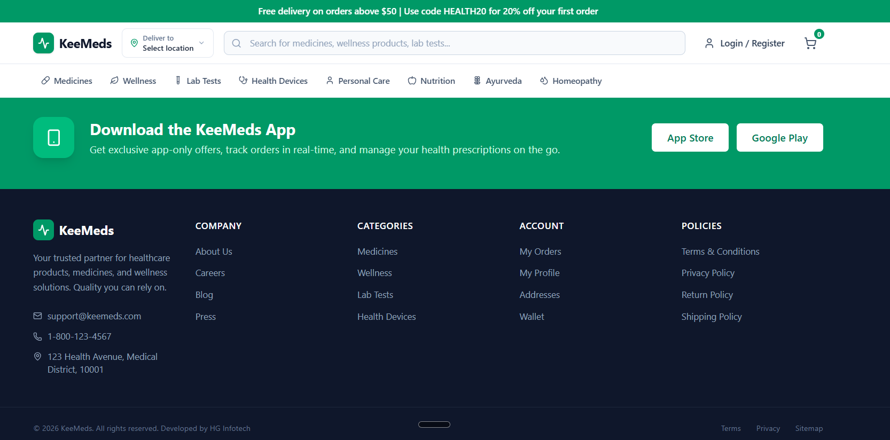

<div align="center">

# 💚 Enterprise Healthcare Commerce Platform - Frontend

Modern Healthcare Commerce Platform built with **React**, **Vite**, and **TypeScript**.



</div>

---

## 🚀 Overview

The frontend delivers a fast, modern, and responsive healthcare commerce experience inspired by Tata 1mg while integrating seamlessly with the ERPNext backend through secure REST APIs.

---

## ⚛️ Tech Stack

- ⚛️ React
- ⚡ Vite
- 📘 TypeScript
- 🔄 React Router
- 🔍 TanStack Query
- 🌐 Axios
- 🎨 Tailwind CSS

---

## ✨ Key Features

- 🏠 Modern Landing Page
- 🔎 Intelligent Product Search
- 💊 Medicine Catalog
- 📄 Product Details
- 🛒 Shopping Cart
- 💳 Secure Checkout
- 📦 Order Tracking
- ❤️ Wishlist
- 📤 Prescription Upload
- 👤 Customer Dashboard
- 🔔 Notifications
- 🎁 Offers & Loyalty
- 🧪 Lab Test Booking
- 👨‍⚕️ Doctor Consultation

---

## 🏗 Architecture
=======
# KeeMeds Commerce Frontend

Standalone React frontend for the KeeMeds healthcare commerce platform.

The project is **fully self-contained** — it does not depend on the
ERPNext/Frappe workspace layout and can be cloned and run on any machine.
All business functionality currently runs against in-memory **mock services**;
the architecture is prepared so real ERPNext services can later replace only
the service implementations.

## Stack

- React 19 + TypeScript
- Vite 8 (build tool) with `@tailwindcss/vite`
- Tailwind CSS v4 (design tokens in `src/styles/tokens.css`)
- React Router v7 (lazy-loaded routes + auth guards)
- TanStack React Query (data fetching) + Zustand (client state)
- react-hook-form + zod (validation), axios (HTTP)

## Getting started
>>>>>>> feature/payment-ui

```bash
npm install
```
<<<<<<< HEAD
React UI
     │
     ▼
API Service Layer
     │
     ▼
Frappe REST APIs
     │
     ▼
ERPNext Business Engine
```

---

## 📂 Project Structure

```text
src/
├── app/
├── api/
├── assets/
├── components/
├── config/
├── constants/
├── hooks/
├── layouts/
├── pages/
├── providers/
├── routes/
├── services/
├── styles/
├── types/
└── utils/
```

---

## 🎯 Design Principles

- 📱 Mobile First
- 🎨 Enterprise UI/UX
- ♻️ Reusable Components
- ⚡ High Performance
- 🔒 Secure API Communication
- 📦 Scalable Architecture
- 🧩 Clean Component Design

---

## 🔗 Related Repository

**Backend Repository**

👉 https://github.com/KLBramhananda/Enterprise-Healthcare-Commerce-Platform-B

---

## 📌 Project Status

🚧 **Active Development**

This project is being developed phase-by-phase following enterprise architecture and best practices using React, Frappe Framework, and ERPNext.

---

## 👨‍💻 Author

**Bramhananda K L**

Full Stack Developer • ERPNext Developer • Solution Architect

---

<div align="center">

Made with ❤️ using React + ERPNext + Frappe

</div>
=======

Create a local environment file from the template (optional — the app runs with
sane defaults without one):

```bash
copy .env.example .env.local     # Windows
cp .env.example .env.local       # macOS / Linux
```

Run the dev server, build, or lint:

```bash
npm run dev       # Vite dev server (default http://localhost:5173)
npm run build     # Type-check + production build to dist/
npm run lint      # ESLint
npm run preview   # Preview the production build
```

No backend is required: the app is driven entirely by mock services out of the
box. The optional Vite dev proxy (`/api` → `VITE_PROXY_TARGET`, default
`http://localhost:8000`) is only exercised when real backend services are
connected.

## Environment configuration

All configurable values are centralized in `src/config/env.ts` and read from
`VITE_*` environment variables. See `.env.example` for the full list:

| Variable | Default | Purpose |
| --- | --- | --- |
| `VITE_APP_ENV` | `development` | Deployment environment (`development`/`staging`/`production`) |
| `VITE_APP_NAME` | `KeeMeds` | Application name (used in `<title>`, header, footer, SEO) |
| `VITE_APP_TAGLINE` | `Your Trusted Healthcare Partner` | Auth-layout tagline |
| `VITE_APP_DESCRIPTION` | `KeeMeds - Online Healthcare Commerce Platform` | Meta description |
| `VITE_API_BASE_URL` | `/api/method` | API client base URL |
| `VITE_PROXY_TARGET` | `http://localhost:8000` | Dev-server `/api` proxy target |
| `VITE_API_TIMEOUT` | `30000` | Request timeout (ms) |
| `VITE_QUERY_STALE_TIME` | `300000` | React Query stale time (ms) |
| `VITE_QUERY_RETRY_COUNT` | `1` | React Query retry count |
| `VITE_IMAGE_BASE_URL` | *(empty)* | CDN/media base URL for product images |
| `VITE_UPLOAD_BASE_URL` | *(empty)* | Base URL for user-uploaded files |
| `VITE_APP_STORE_URL` | Apple store | iOS app store link |
| `VITE_GOOGLE_PLAY_URL` | Play store | Android app store link |
| `VITE_DEV_PORT` | `5173` | Dev server port |
| `VITE_FEATURE_*` | `true` | Feature flags (see `FEATURES` in `src/config/env.ts`) |

## API client

`src/api/client.ts` centralizes:

- base URL (`API_BASE_URL`)
- request configuration (headers, `withCredentials`, timeout)
- auth token injection (Authorization header from the persisted auth store)
- error handling (401/403 → clear session + redirect to login;
  `getErrorMessage` normalizes error messages)

Service interfaces do not call it directly today — mock services are used
instead. ERPNext implementations will route through this client.

## Architecture

```
src/
  api/        Shared HTTP client + request/error helpers
  app/        Root App component + providers wiring
  components/ UI primitives (ui/), layout, checkout, support, cart
  config/     Environment config, constants, endpoints, navigation, languages
  hooks/      Domain hooks (auth, catalog, checkout, shopping, support, ...)
  layouts/    CommerceLayout / AuthLayout shells
  pages/      Route-level page components
  providers/  Global providers (React Query, Toast, Layout)
  routes/     Lazy-loaded route table + auth guards
  services/   Service interfaces (IAuthService, ICatalogService, ...) + mocks
  store/      Zustand persisted stores
  styles/     Design tokens (Tailwind v4 @theme)
  types/      Domain types (mirror the future ERPNext API contract)
  utils/      cn, formatters, toast/notification helpers
```

### Services

The service layer is interface-driven. Each domain declares a contract
(`src/services/*Service.ts`) implemented today by an in-memory mock
(`*Mock.ts`). `src/services/factory.ts` is the single injection point:

- To switch a domain to ERPNext, add an `ErpNext*Service` implementing the
  same interface and swap it in `factory.ts`. No hooks, stores, pages, or
  components need to change.
>>>>>>> feature/payment-ui
